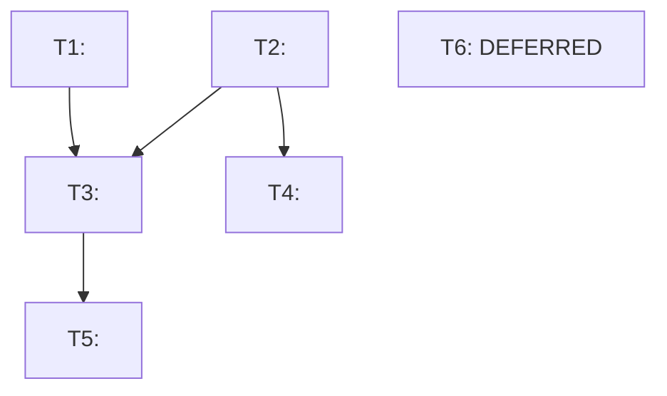

# Gap Analysis [YYYY-MM-DD]

**Date**: <YYYY-MM-DD>
**Supersedes**: [<prior-gap-analysis-filename>](<relative/path/to/prior>) - <one-line description of prior scope>; or "Nothing - first gap analysis for this scope"
**Branch**: <git branch name>
**Head commit**: <short hash> - <commit subject line>
**Verification basis**: <File inspection | File inspection + build | File inspection + build + runtime>
**Scope**: <One sentence: which planning documents and which codebase areas this analysis covers>

<!--
  AUTHORING INSTRUCTIONS (remove this block before committing)
  ─────────────────────────────────────────────────────────────
  Author:    gem-planner (sole file author for gap-analysis.md)
  Input:     gem-researcher verified findings
  Spec:      .github/skills/c2l-gap-analysis/references/gap-analysis-specification.md
  State:     .github/skills/c2l-gap-analysis/references/plan-state-contract.md
  Plan dir:  ${PLAN_ROOT}/${SCOPE}-gap-analysis-YYYYMMDD/
  plan.yaml: plan_id=${SCOPE}-gap-analysis-YYYYMMDD
             plan_path=${PLAN_ROOT}/${SCOPE}-gap-analysis-YYYYMMDD/plan.yaml
             source_document=${PLAN_ROOT}/${SCOPE}-gap-analysis-YYYYMMDD/gap-analysis.md
  Same-day:  This dated directory is the single same-day artifact set for the scope.
             If all items are Done/Stale, create only gap-analysis.md and report that
             same-day result on re-invocation instead of creating a second fresh run.
  Dates:     Use YYYYMMDD for directory names / run IDs and YYYY-MM-DD in prose fields.
  Template:  Replace every <angle-bracket placeholder> with real content.
             Remove all HTML comment blocks before committing.
             Do not rename, reorder, or omit any mandatory section.
-->

<!-- toc:start -->

  
<strong>Table of Contents</strong> - click to open

- [1  Purpose & Scope](#1--purpose--scope)
- [2  Executive Summary](#2--executive-summary)
- [3  Document Lineage](#3--document-lineage)
- [4  Master Verification Table](#4--master-verification-table)
- [5  Key Findings](#5--key-findings)
- [6  Remaining Task Register](#6--remaining-task-register)
- [7  Recommended Execution Order](#7--recommended-execution-order)
- [8  Dependency Graph](#8--dependency-graph)
- [9  Acceptance Criteria](#9--acceptance-criteria)
- [10  Deferred Items](#10--deferred-items)
- [11  Verification Notes](#11--verification-notes)

<!-- toc:end -->

---

## 1  Purpose & Scope

<!--
  Mandatory content (max 200 words):
  1. What this analysis compares (planning docs vs codebase areas).
  2. What this document is NOT.
  3. If a re-run: what changed from prior analysis.
-->

<One paragraph describing what is being compared and why this analysis was run.>

This is a **<delivery gap analysis | regulatory gap analysis | documentation drift analysis>**, not a <what this is not>. For <what readers seeking other information should read instead>, see <link>.

---

## 2  Executive Summary

<!--
  Mandatory content:
  - Backend status bullet
  - Frontend/UI status bullet
  - Key discovery bullet (most important finding)
  - Critical path bullet (T? -> T? -> T?)
  - Total effort bullet
  If all Done: single bullet "All items verified complete as of commit `<hash>`."
  Output location in that case remains ${PLAN_ROOT}/${SCOPE}-gap-analysis-YYYYMMDD/gap-analysis.md
  Same-day re-invocation reports this existing result; do not create a second fresh run.
-->

- The <Module> **backend is <X>% complete**. <List 2-3 confirmed-present elements with their file/class names.>
- The <Module> **frontend <status description>**. <Describe what works and what does not.>
- <Key discovery>: <The single most important finding, e.g., "Several pages that appear implemented are likely not functional due to binding mismatches between `controllerAs: 'vm'` controllers and bare-scope view bindings.">
- **Critical path**: <T1 -> T2 -> T3> - <one sentence on what this chain unblocks.>
- **Total remaining effort**: ~<X-Y> engineer-days for <scope description>.

---

## 3  Document Lineage

<!--
  List every prior gap analysis for this scope in ascending date order.
  This document is the last row with "Superseded by" = "- (current)".
  Relative paths from this file's location.
-->

| Date | Document | Role | Superseded by |
| ---- | -------- | ---- | ------------- |
| <YYYY-MM-DD> | [<filename>](<relative/path>) | <one-line role> | [<later-doc>](<path>) |
| <YYYY-MM-DD> | **This document** | <role of this document> | - (current) |

---

## 4  Master Verification Table

<!--
  THE source of truth for every planning item's implementation status.
  One row per distinct planning deliverable.
  Sort: Done first, then Partial, then Missing, then Stale. Within each group: by Source section.

  Status symbols:
    ✅ Done    - file exists, content correct, tests pass. Must cite evidence.
    ⚠️ Partial - file exists but incomplete/incorrect. Evidence states what's missing.
    ❌ Missing  - not found. Evidence states where you searched.
    🔁 Stale   - prior doc claims missing; codebase shows done. Evidence cites what was found.

  Verification values:
    File inspection | File inspection + build | File inspection + build + runtime
-->

| MVT | Planning Item | Source | Type | Status | Verification | Evidence | Task |
| --- | ------------- | ------ | ---- | ------ | ------------ | -------- | ---- |
| MVT-001 | <brief deliverable description> | <Doc §N.N> | <type> | ✅ Done | File inspection | `<path/to/file.cs>` - `<MethodName()>` | - |
| MVT-002 | <brief deliverable description> | <Doc §N.N> | <type> | ⚠️ Partial | File inspection | `<path/to/file.cshtml>` exists; <what is incomplete> | T<N> |
| MVT-003 | <brief deliverable description> | <Doc §N.N> | <type> | ❌ Missing | File inspection | Searched `<directory>`; no file matching `<pattern>` found | T<N> |
| MVT-004 | <brief deliverable description> | <prior-gap-analysis.md> | <type> | 🔁 Stale | File inspection | Prior doc claimed missing; found at `<path>` line <N> | - |

---

## 5  Key Findings

<!--
  One sub-section per distinct finding category. Required if any Partial/Missing rows exist.
  Each sub-section: state finding -> concrete examples -> impact -> recommended action.
  Do not repeat MVT table content verbatim - interpret it.
  If all Done: "No significant findings. All items verified complete."
-->

### 5.1  <Finding Category Name>

<State the finding. Reference specific files, methods, or patterns.>

**Impact**: <What breaks or is misleading as a result of this finding.>

**Examples**:

- `<file>`: <specific problem>
- `<file>`: <specific problem>

**Recommended action**: <What must be done to address this finding.>

### 5.2  <Finding Category Name>

<Repeat pattern for each additional finding category.>

---

## 6  Remaining Task Register

<!--
  One card per task. Tasks in recommended execution order (T1 first = should execute first).
  Only Partial/Missing MVT items may generate tasks.
  Every card must include MVT refs linking back to Section 4.
  P4 tasks also appear in Section 10.
-->

### Priority Legend

| Priority | Meaning |
| -------- | ------- |
| **P0** | Immediate - current state is broken or misleading |
| **P1** | Critical path - blocks the basic end-to-end workflow |
| **P2** | Important - completeness, not a blocker |
| **P3** | Valuable - not on MVP path |
| **P4** | Deferred - explicitly out of scope for this run |

---

### T1 - <Task Title>

| Attribute | Value |
| --------- | ----- |
| **Priority** | <P0 - Immediate> |
| **Complexity** | <Low / Medium / High> |
| **Effort** | <X-Y days> |
| **Depends on** | <T# - Title / Nothing> |
| **MVT refs** | <MVT-NNN, MVT-NNN> |

**Problem**: <One paragraph citing specific files and methods that are wrong or missing. Do not describe the PRD - describe what the codebase is actually missing.>

**Implementation**:

1. <Concrete step with file path>
2. <Concrete step with file path>
3. <Continue as needed>

**Reference**: [<Doc §N.N>](<relative/path>) - <one-line description of the spec section>

---

### T2 - <Task Title>

| Attribute | Value |
| --------- | ----- |
| **Priority** | <P1 - Critical path> |
| **Complexity** | <Low / Medium / High> |
| **Effort** | <X-Y days> |
| **Depends on** | <T1 - Title> |
| **MVT refs** | <MVT-NNN, MVT-NNN> |

**Problem**: <Problem statement with file/method citations.>

**Implementation**:

1. <Concrete step>
2. <Concrete step>

**Reference**: [<Doc §N.N>](<relative/path>) - <description>

<!--
  Continue adding task cards as needed: T3, T4, ...
  Maintain ascending order by recommended execution sequence.
-->

---

## 7  Recommended Execution Order

<!--
  Numbered phases. Each phase names the tasks that can run concurrently within it.
  Must be consistent with dependency declarations in task cards.
  If zero tasks: "N/A - no remaining tasks."
-->

1. **Phase 1** - <T1, T2>: <Rationale: e.g., "Clean up prerequisites that block all subsequent work.">
2. **Phase 2** - <T3, T4>: <Rationale.>
3. **Phase 3** - <T5>: <Rationale.>

**Parallelization notes**:

- <T# and T# can run concurrently because they touch different files/areas.>
- <T# must wait for T# because it depends on the data contract established by T#.>

---

## 8  Dependency Graph

<!--
  Mermaid graph TD. Every task from Section 6 must appear as a node.
  This graph represents the full backlog and is not redrawn per continuation pass.
  P4/deferred tasks: label as "[T# - DEFERRED]".
  No dependencies (all independent): flat node list + note "All tasks independent."
  Zero tasks: "N/A."
-->

---

## 9  Acceptance Criteria

<!--
  GitHub task list syntax (- [ ]).
  Group by task. At least one criterion per task.
  At least one criterion must be build-level or runtime-level, not just file-level.
  "Code is written" is NOT an acceptance criterion.
  If zero tasks: "N/A - no tasks. All items verified complete."
-->

### Acceptance - T1 - <Task Title>

- [ ] <Falsifiable check: e.g., "`AiSystemIndex.cshtml` - all bindings use `vm.` prefix; no bare scope references remain">
- [ ] <Build check: e.g., "VS Code task `msbuild:build` succeeds with no new errors">

### Acceptance - T2 - <Task Title>

- [ ] <Falsifiable check>
- [ ] <Runtime check: e.g., "Index page loads at the module URL and displays a list of records">

---

## 10  Deferred Items

<!--
  All P4 tasks from Section 6 appear here.
  Items deferred from prior gap analyses that remain deferred also appear here.
  "Revisit When" must be a concrete trigger, not "later" or "TBD."
  If nothing deferred: "None. All identified items are in scope."
-->

| ID | Item | Priority | Disposition | Revisit When |
| -- | ---- | -------- | ----------- | ------------ |
| T<N> | <Description> | P4 | <Why deferred> | <Concrete trigger, e.g., "After T4/T6 complete" or "v1.x planning"> |

---

## 11  Verification Notes

<!--
  Mandatory. Max 300 words.
  1. Branch and commit (repeat from header for auditability).
  2. What was inspected and how.
  3. Known limitations (what could NOT be verified and why).
  4. Any assumptions made.
-->

**Branch**: `<branch-name>` at commit `<short-hash>`.

**Verification method**: <Describe exactly what was done, e.g., "File-by-file inspection of `Coach2Lead.Web/Areas/<Module>/`, grep for key method names, cross-referenced against planning documents. VS Code task `msbuild:build` confirmed with exit code 0.">

**Known limitations**:

- <e.g., "Runtime behavior of the approval modal was not tested - assessment is based on code inspection only.">
- <e.g., "EF migration correctness was verified by inspecting `Up()` and `Down()` methods, not by running `Update-Database` against a live instance.">

**Assumptions**:

- <e.g., "Files present in the target Area directory but not registered in `.csproj` are treated as non-deployed.">
- <Remove this sub-section if no assumptions were made.>
