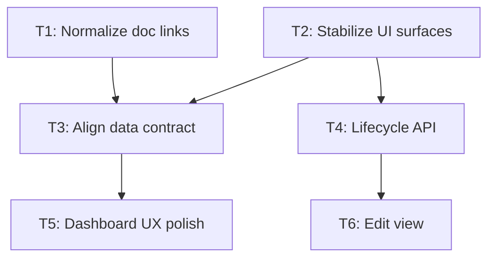

# gap-analysis.md - Authoring Specification

This document defines the **mandatory structure, content rules, and authoring constraints** for every `gap-analysis.md` produced by the `c2l-gap-analysis` skill. It is normative: deviations are bugs, not style choices.

**Author**: `gem-planner` (sole file author for `gap-analysis.md`). Input comes from `gem-researcher` findings. Do not write this file without verified research findings.

**Template**: See [`gap-analysis-skeleton.md`](gap-analysis-skeleton.md) for a fill-in-the-blanks starting point.

**Related plan artifact contract**: When this analysis produces companion planning artifacts, they live in `${PLAN_ROOT}/${SCOPE}-gap-analysis-${YYYYMMDD}/` and `plan.yaml` must set `plan_id: ${SCOPE}-gap-analysis-${YYYYMMDD}`, `plan_path: ${PLAN_ROOT}/${SCOPE}-gap-analysis-${YYYYMMDD}/plan.yaml`, and `source_document: ${PLAN_ROOT}/${SCOPE}-gap-analysis-${YYYYMMDD}/gap-analysis.md`. The detailed same-day state machine, task-status contract, and history-field rules live in [`plan-state-contract.md`](plan-state-contract.md).

---

## Canonical Section Order

Every `gap-analysis.md` MUST contain these sections, in this order:

| # | Section | Required |
| --- | ------- | -------- |
| - | Document Header Block | Mandatory |
| 1 | Purpose & Scope | Mandatory |
| 2 | Executive Summary | Mandatory |
| 3 | Document Lineage | Mandatory |
| 4 | Master Verification Table | Mandatory |
| 5 | Key Findings | Mandatory if any Partial/Missing items exist |
| 6 | Remaining Task Register | Mandatory if any tasks exist |
| 7 | Recommended Execution Order | Mandatory if >=2 tasks exist |
| 8 | Dependency Graph | Mandatory if any task dependencies exist |
| 9 | Acceptance Criteria | Mandatory |
| 10 | Deferred Items | Mandatory (even if empty - state "None") |
| 11 | Verification Notes | Mandatory |

Supplementary sections (not part of the numbered `gap-analysis.md` structure) follow Section 11. See [Verification Checklist per Item Type](#verification-checklist-per-item-type) for per-type verification requirements.

Sections may have sub-sections. Section numbers must match exactly. Do not rename sections or reorder them.

---

## Document Header Block

Placed immediately after the H1 title, before the TOC. Formatted as a definition list (bold label, value on same line):

```markdown
**Date**: YYYY-MM-DD
**Supersedes**: [prior-gap-analysis.md](relative/path) - brief description of what it superseded; or "Nothing - first gap analysis"
**Branch**: <git branch name at time of analysis>
**Head commit**: <short commit hash> - <commit subject line>
**Verification basis**: <one of: File inspection | File inspection + build | File inspection + build + runtime>
**Scope**: <one sentence describing what planning documents and codebase areas are covered>
```

Rules:

- `Date` is the date the analysis was produced, not the date of codebase state.
- `Supersedes` must link to the actual prior document, not a generic filename. If this is the first gap analysis, write "Nothing - first gap analysis for this scope."
- `Head commit` must be filled. Run `git rev-parse --short HEAD` if not already known. Never leave this blank or write "unknown" - this is the single most important anchor for reproducibility.
- `Verification basis` must honestly reflect actual work done. `File inspection` is the minimum valid basis. If a planning item could not be checked against the live codebase, stop and resolve that gap before finalizing the analysis.

---

## Section 1 - Purpose & Scope

**Purpose**: State what this document is for and what it explicitly does not cover.

**Mandatory content**:

1. One paragraph: what the analysis compares (which planning docs vs which codebase areas).
2. One sentence: what this document is NOT (e.g., "This is a delivery gap analysis, not a regulatory interpretation document").
3. If this is a re-run: one sentence stating what changed from the prior analysis that motivated this run.

**Rules**:

- Maximum 200 words. This section is orientation, not findings.
- Do not repeat the Executive Summary here (that comes next).

---

## Section 2 - Executive Summary

**Purpose**: Give a reader the complete picture in under 10 bullet points. Must be accurate and honest - do not overstate completeness.

**Mandatory content**:

1. Backend status bullet: `The [module] **backend is [X]% complete**.` followed by 1-2 evidence phrases listing what is confirmed present.
2. Frontend/UI status bullet: `The [module] **frontend [status description]**.` Describe what works and what does not.
3. Key discovery bullet (if any): the single most important finding from this analysis (e.g., "Several pages that appear implemented are likely not functional due to binding mismatches").
4. Critical path bullet: `**Critical path**: T? -> T? -> T?` - the minimum chain of tasks to reach a working state.
5. Total remaining effort bullet: `**Total remaining effort**: ~X-Y engineer-days` (if tasks exist).

**Rules**:

- Use bold for status assessments (`**backend is 95% complete**`).
- If all items are verified complete, write a single bullet: "All items verified complete as of commit `<hash>`. No tasks required." Then omit Sections 5, 6, 7, 8 (leave them as "N/A - no remaining work").
- Accuracy over optimism. "~95% complete" is acceptable. "Complete" requires every item in the Master Verification Table to be Done.

---

## Section 3 - Document Lineage

**Purpose**: Provide a navigable history of all gap analyses and related planning documents for this scope, in chronological order.

**Mandatory format**:

```markdown
| Date | Document | Role | Superseded by |
|------|----------|------|---------------|
| YYYY-MM-DD | [filename](relative/path) | one-line description | [later-doc](path) or "This document" |
| ... | ... | ... | ... |
```

Rules:

- Include **every** prior gap analysis for this scope, not just the immediately prior one.
- The current document appears as the last row, with "Superseded by" = "- (current)".
- If a document was superseded mid-stream (e.g., replaced before it was fully acted on), note this in the Role column.
- Relative paths must resolve from the location of this file.
- Do not include unrelated documents (general PRDs, ADRs, PLANs) unless they were themselves used as the primary source for a gap analysis.

---

## Section 4 - Master Verification Table

**Purpose**: The single source of truth for the implementation status of every item in the planning documents. This table is the anti-stale-document mechanism: every claim of Done, Partial, or Missing must have an evidence entry.

**Mandatory format**:

```markdown
| MVT | Planning Item | Source | Type | Status | Verification | Evidence | Task |
|-----|--------------|--------|------|--------|--------------|----------|------|
| MVT-001 | Brief description | PRD-01 §5.2 | API endpoint | ✅ Done | File inspection | `ResourceController.cs` line 42 - `GetNodeDetail()` | - |
| MVT-002 | Brief description | PLAN-003 §2.1 | UI view | ⚠️ Partial | File inspection | `AiSystemDetail.cshtml` exists; binding mismatch on `currentVersion` | T2 |
| MVT-003 | Brief description | PRD-02 §3.4.5 | EF migration | ❌ Missing | File inspection | Searched `Coach2Lead.Web/Migrations/` - no migration for `AiRiskMitigation` table | T4 |
| MVT-004 | Brief description | 2026-03-16-gap-analysis.md | Angular resource | 🔁 Stale | File inspection + build | Doc claims missing; found in `module.resources.js` line 88 `getVersionDiff()` | - |
```

**Column definitions**:

| Column | Rules |
| ------ | ----- |
| **MVT** | Sequential `MVT-NNN` (3-digit zero-padded) within this document. IDs must be unique within the current `gap-analysis.md`. |
| **Planning Item** | The specific deliverable described in the planning document. Max 80 chars. Use the actual PRD/PLAN language, not your own summary. |
| **Source** | Document name and section. Must be a real document. Use `[Doc §N.N]` format when linking. |
| **Type** | One of: `API endpoint`, `Angular resource`, `UI view`, `Route/state`, `Menu entry`, `Domain service`, `EF model`, `EF migration`, `Test`, `Documentation link`, `Other`. |
| **Status** | `✅ Done`, `⚠️ Partial`, `❌ Missing`, `🔁 Stale`. See status rules below. |
| **Verification** | One of: `File inspection`, `File inspection + build`, `File inspection + build + runtime`. Never leave blank. |
| **Evidence** | For Done: file path + method/line. For Partial: file path + what's missing. For Missing: what was searched and where. For Stale: what was found and where. Never write "not found" without stating where you looked. |
| **Task** | `T1`, `T2`, etc. from Section 6, or `-` if Done/Stale with no action. |

**Status rules**:

- **✅ Done**: File exists AND content is correct AND supporting validation evidence is present. Cite a file path or commit hash, and include build/test/runtime evidence when it was part of verification. "Done" with no evidence is not permitted.
- **⚠️ Partial**: File exists but the implementation is incomplete or incorrect. Describe in Evidence exactly what is incomplete.
- **❌ Missing**: No implementation found. State in Evidence where you searched (directories, grep patterns).
- **🔁 Stale**: The prior gap analysis claims this is missing, but the codebase shows it is done. Cite the evidence. This is a common finding in fast-moving codebases.

**Task generation rule**: `✅ Done` and `🔁 Stale` rows never generate implementation tasks. Only `⚠️ Partial` and `❌ Missing` rows may appear in Section 6.

**Coverage requirement**: Every distinct deliverable in the planning documents for the declared scope must have a row. If you cannot verify an item against the live codebase, stop the analysis, record the blocker in Section 11, and resolve the verification gap before finalizing `gap-analysis.md`.

**Sorting**: Group rows by Status (Done first, then Partial, then Missing, then Stale). Within each group, sort by Source document section.

---

## Section 5 - Key Findings

**Purpose**: Narrative analysis of significant patterns or discoveries. This section provides the *why* behind the status codes in the Master Verification Table.

**Mandatory content**:

- One sub-section per distinct finding category. Minimum one sub-section if any Partial or Missing items exist.
- Typical categories: `Documentation Drift`, `Broken UI Surfaces`, `Missing API Surface`, `Incomplete Feature Delivery`, `Test Coverage Gaps`.
- Each sub-section must: (a) state the finding, (b) provide concrete examples with file names, (c) state the impact, (d) state the recommended action.

**Rules**:

- Do not repeat information already in the Master Verification Table verbatim. The Table is the record; this section is the interpretation.
- Sub-section headings use `###` and include a short finding name: `### 5.1 Documentation Drift`.
- If all items are Done, write a single sentence: "No significant findings. All items verified complete."

---

## Section 6 - Remaining Task Register

**Purpose**: A prioritized, dependency-ordered list of implementation tasks. Only items that are Partial or Missing in the Master Verification Table may generate tasks.

**Per-task card format** (every task must use this exact format):

```markdown
### T1 - <Task Title>

| Attribute | Value |
|-----------|-------|
| **Priority** | P0 - Immediate / P1 - Critical path / P2 - Important / P3 - Valuable / P4 - Deferred |
| **Complexity** | Low / Medium / High |
| **Effort** | X-Y days |
| **Depends on** | T# - <title>, T# - <title> / Nothing |
| **MVT refs** | MVT-NNN, MVT-NNN (all Master Verification Table rows addressed by this task) |

**Problem**: <One paragraph describing what is wrong or missing in the codebase. Cite file names and method names. Do not describe what the planning document says - describe what the codebase is actually missing.>

**Implementation**: <Numbered list of concrete implementation steps. Be specific enough that gem-implementer can execute without reading the original PRD. Reference exact file paths where known.>

**Reference**: <Link to the planning document section that contains the full spec for this feature, if one exists.>
```

**Priority definitions**:

| Priority | Meaning |
| -------- | ------- |
| **P0** | Immediate correction required. Current state is broken, misleading, or prevents basic use. |
| **P1** | Critical path to a usable end-to-end workflow. Nothing useful ships until this is done. |
| **P2** | Important for completeness, but does not block the basic workflow. |
| **P3** | Valuable, but not on the MVP path. |
| **P4** | Explicitly deferred or optional. Will not be implemented in this run. |

Cross-artifact mapping into `plan.yaml` lives in [`plan-state-contract.md`](plan-state-contract.md) §Priority Mapping and must be applied exactly.

**Rules**:

- Task IDs are `T1`, `T2`, ... in execution-recommended order, not random.
- Every task card must include `MVT refs` - this links tasks back to the Master Verification Table.
- The `Problem` statement must cite at least one concrete file path or method name. "The feature is missing" is not acceptable.
- If a task has no planning document reference (it was discovered through codebase inspection, not planning), write "Discovered: not in planning documents" in the Reference field.
- P4 tasks appear in the Task Register with a clear `P4 - Deferred` label. They also appear in Section 10.
- Dependency declarations are normative: downstream plan artifacts must not allow a task to enter scope unless every prerequisite task is already completed or enters the same scoped pass.

---

## Section 7 - Recommended Execution Order

**Purpose**: Prescribe the order in which tasks should be executed, with parallelization notes.

**Mandatory content**:

1. A numbered list of execution phases, each naming the tasks in that phase.
2. Brief rationale for each grouping (why these tasks can run together or must be sequential).
3. Parallelization notes: which tasks can safely run concurrently and which must not.

**Rules**:

- Order must be consistent with the dependency chains declared in Section 6 task cards.
- If there are zero tasks, write "N/A - no remaining tasks."

---

## Section 8 - Dependency Graph

**Purpose**: Visual representation of the full backlog dependency structure for gem-orchestrator dispatch planning.

**Mandatory format**: Mermaid `graph TD` diagram.

**Example**:



**Rules**:

- Every task from Section 6 must appear as a node.
- The graph represents the full backlog for the dated plan. It is not rewritten per continuation pass to show only the currently in-scope subset; current scope is communicated elsewhere in `plan.md`.
- Deferred (P4) tasks appear with a `:::deferred` class or `[T# - DEFERRED]` label.
- If there are no dependency relationships (all tasks are independent), write a flat list of nodes with the note "All tasks are independent."
- If there are zero tasks, write "N/A."

---

## Section 9 - Acceptance Criteria

**Purpose**: Verifiable definition of done. Used by gem-reviewer and the human reviewer to confirm implementation is correct before marking a task completed.

**Mandatory format**: Group criteria by task or by theme. Each criterion must be a falsifiable statement - something that can be checked with a file read, a build, or a browser action.

**Example**:

```markdown
### T2 - Stabilize UI Surfaces

- [ ] `AiSystemIndex.cshtml`: all bindings use `vm.` prefix; no bare scope references
- [ ] `AiSystemDetail.cshtml`: `vm.currentVersion` and `vm.versions` are populated by controller
- [ ] All 9 Settings `.cshtml` views: bindings use `vm.` prefix
- [ ] `PageController.cs`: namespace matches the target Area
- [ ] Solution builds: VS Code task `msbuild:build` succeeds
```

**Rules**:

- Use GitHub-style task list syntax (`- [ ]`).
- At least one criterion per task.
- At least one criterion must be build-level (solution builds after changes) or runtime-level (page loads, action succeeds) - not just file-level.
- "Code is written" is not an acceptance criterion. "The index page loads and displays real records" is.

---

## Section 10 - Deferred Items

**Purpose**: Record what is explicitly out of scope for this run and why.

**Mandatory format**:

```markdown
| ID | Item | Priority | Disposition | Revisit When |
|----|------|----------|-------------|--------------|
| T8 | Notifications and subscriptions | P4 | Lifecycle events must stabilize first | After T4/T6 complete |
| G1 | AI literacy training fields | P4 | Not a regulatory blocker | v1.x |
```

**Rules**:

- Every P4 task from Section 6 must appear here.
- Items from prior gap analyses that remain deferred must also appear here (with their original ID or a cross-reference).
- If nothing is deferred, write: "None. All identified items are in scope."
- `Disposition` states why the item is intentionally out of scope for the current run. It must be a specific reason such as dependency sequencing, product choice, or explicit user deferral.
- `Revisit When` must be a concrete trigger (another task completing, a product decision, a date) - not "later" or "TBD."

---

## Section 11 - Verification Notes

**Purpose**: Record the conditions and constraints under which verification was performed. Used to assess the reliability of the findings.

**Mandatory content**:

1. Branch and commit at time of analysis (even if already in the header block - repeat here for clarity).
2. Verification method summary: what was inspected and how (file reads, grep, build, runtime checks).
3. Known limitations: what could NOT be verified and why (e.g., "Runtime behavior of the approval modal was not tested - assessment is based on code inspection only").
4. Any assumptions made (e.g., "Assumed that files present in the target Area but not registered in `.csproj` are not deployed").

**Rules**:

- Never omit known limitations. If you only inspected files and did not run the build, say so. If you ran the build but not runtime, say so.
- Maximum 300 words. This is an audit trail, not a narrative.

---

## Global Rules

These rules apply to the entire document:

1. **No stale claims without evidence.** Every Done item has a cited file path or commit hash. Every Missing item has a stated search location.
2. **Every row in the Master Verification Table maps to at most one task.** If one task fixes multiple rows, all MVT refs appear in the task card.
3. **Consistency between sections.** A task that appears in the Task Register must appear in the Dependency Graph, the Execution Order, and the Acceptance Criteria. A deferred task must appear in both the Task Register (labeled P4) and the Deferred Items table.
4. **No invented planning items.** Tasks must trace to a row in the Master Verification Table, and that row must trace to a planning document (or a "discovered in codebase inspection" note).
5. **Implementation acceptance.** If tasks exist, the Acceptance Criteria for the plan must include at least one "solution builds" criterion.
6. **Document length.** There is no length limit. Completeness is required. Omitting a section or a table row to save space is not permitted.

---

## Minimum Viable Gap Analysis (when all items are Done)

When `gem-researcher` finds everything verified complete:

The deliverable still lives at `${PLAN_ROOT}/${SCOPE}-gap-analysis-${YYYYMMDD}/gap-analysis.md`; only `plan.yaml` and `plan.md` are omitted. That dated directory remains the single same-day artifact set for the scope, so later same-day invocations report the existing completed analysis instead of creating a second fresh run.

1. Document Header Block - mandatory (same rules).
2. Section 1 Purpose & Scope - one paragraph.
3. Section 2 Executive Summary - single bullet: "All items verified complete as of commit `<hash>`."
4. Section 3 Document Lineage - mandatory (same rules).
5. Section 4 Master Verification Table - mandatory. All rows will show ✅ Done or 🔁 Stale.
6. Sections 5-8 - write "N/A - no remaining work."
7. Section 9 Acceptance Criteria - write "N/A - no tasks. All items verified complete."
8. Section 10 Deferred Items - mandatory (record any deferred items from prior analyses).
9. Section 11 Verification Notes - mandatory.

No `plan.yaml` or `plan.md` is needed in this case. The `gap-analysis.md` alone is the deliverable.

---

## Verification Checklist per Item Type

This checklist defines the verification steps required for each item type encountered in the Master Verification Table (Section 4). Referenced by SKILL.md §Research Phase for classification verification.

| Item type | Verify |
| --------- | ------ |
| API endpoint | Controller action exists, `[HttpPost]`/`[HttpGet]` + `[ActionName]`, permission attribute, company scoping |
| Angular resource | Method exists in `*.resources.js`, uses correct URL and DI pattern |
| UI view | `.cshtml` exists, `controllerAs` bindings correct (not bare scope), data bindings resolve to real DTO properties |
| Route/state | Entry exists in `*.routes.js`, state name follows convention, URL pattern correct |
| Menu entry | Entry exists in `*.menu.js`, permission guard correct |
| Domain service | Method exists, handles the claimed business rule, has test coverage |
| EF migration | Follow the verification steps in the `c2l-ef6-migrations` companion skill; use the **`ef6:update-database-script`** VS Code task to confirm no pending migrations remain |
| Test | Test file exists, test methods present, `[Test]` attribute, correct base class |
| Documentation link | Target file exists on disk, link syntax resolves |
