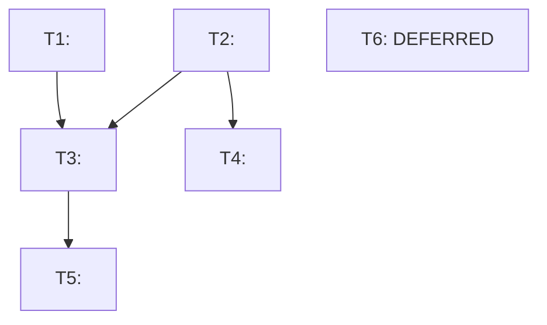

# Gap Analysis Plan [YYYY-MM-DD]

<!--
  AUTHORING INSTRUCTIONS (remove this block before committing)
  ─────────────────────────────────────────────────────────────
  Author:    gem-planner (sole file author for plan.md)
  Input:     gem-researcher verified findings + gap-analysis.md task register
  Spec:      .github/skills/c2l-gap-analysis/references/plan-md-specification.md
  State:     .github/skills/c2l-gap-analysis/references/plan-state-contract.md
  Plan dir:  ${PLAN_ROOT}/${SCOPE}-gap-analysis-YYYYMMDD/
  Alignment: plan.md and plan.yaml must describe the same work, same order, same scope.
             Any divergence is a bug - update both files together in the same pass.
  Mutability: See spec for per-section rules (replace-in-place vs append-only).
  Template:  Replace every <angle-bracket placeholder> with real content.
             Remove all HTML comment blocks before committing.
             Do not rename, reorder, or omit any mandatory section.
-->

**Plan:** `${SCOPE}-gap-analysis-<YYYYMMDD>`
**Date:** <YYYY-MM-DD>
**Author:** gem-planner
**Source:** `${PLAN_ROOT}/${SCOPE}-gap-analysis-<YYYYMMDD>/gap-analysis.md`

---

## 1  Status Summary

<!--
  REPLACE IN-PLACE on every execution pass. Do not append.
  Run N matches run_number in the latest execution_history entry in plan.yaml.
  Do not include task titles or prose - one-glance indicator only.
-->

**Status:** active
**As of:** <YYYY-MM-DD> (Scoped - pending execution)
**Tasks:** 0 completed · 0 blocked · <N> deferred · <N> total

---

## 2  Executive Summary

<!--
  Set on creation. Update only if the plan's substance changes (scope expansion,
  critical discovery). NOT a status update - describes the persistent plan goal.
  Max 250 words.
-->

<One paragraph: what this plan is for and what gap analysis triggered it.>

- **Critical path:** <T1 -> T2 -> T4>
- **Total effort:** ~<X-Y> engineer-days

---

## 3  Findings Overview

<!--
  Set on creation. Condensed summary from gap-analysis.md Section 4 MVT.
  Counts must match the Master Verification Table. Do not repeat individual rows.
  Do not update on continuation passes unless re-research changes the baseline counts.
-->

| Status | Count | Summary |
|--------|-------|---------|
| ✅ Done | <N> | <One-phrase summary of Done items, or "None"> |
| ⚠️ Partial | <N> | <One-phrase summary, or "None"> |
| ❌ Missing | <N> | <One-phrase summary, or "None"> |
| 🔁 Stale | <N> | <One-phrase summary, or "None"> |

---

## 4  Task Breakdown

<!--
  Set on creation. One H3 sub-section per task in execution order (T1 first).
  Task IDs and titles must match gap-analysis.md Section 6 and plan.yaml tasks[].
  Update only if replanning adds, removes, or structurally changes tasks.
-->

### T1 - <Task Title>

**Priority:** <P0 - Immediate | P1 - Critical path | P2 - Important | P3 - Valuable | P4 - Deferred>
**Effort:** <X-Y days>
**Depends on:** <TN - Title | Nothing>

<One paragraph describing what needs to be done and where. Reference specific file paths and methods.>

---

### T2 - <Task Title>

**Priority:** <P0-P4>
**Effort:** <X-Y days>
**Depends on:** <T1 - Title>

<Problem description with file/method citations.>

<!--
  Continue for each additional task: T3, T4, ...
  Maintain ascending execution order (T1 = first to execute).
-->

---

## 5  Dependency Graph

<!--
  Set on creation. Never narrowed per continuation pass.
  Always represents the full backlog for the dated plan.
  P4 (deferred priority) tasks labeled "[TN - DEFERRED]".
  All tasks independent: flat node list + note "All tasks independent."
-->

---

## 6  Implementation Notes

<!--
  Append-only. Add one H3 sub-section per execution pass. Do not modify earlier passes.
  Use ✅ for completed tasks, 🚫 (Blocked) for blocked tasks.
  Run N matches run_number in the corresponding execution_history entry in plan.yaml.
-->

*No runs completed yet.*

<!--
  Template for each pass:

### Run 1 - YYYY-MM-DD

#### T1 - <Task Title> ✅

**Files modified:** `<path/to/file1.cs>`, `<path/to/file2.cshtml>`

<Notes on non-obvious decisions, amendments, or deviations.
If none: "Implemented as planned. No deviations.">

#### T2 - <Task Title> 🚫 (Blocked)

<Describe what blocked the task and why. Must agree with plan.yaml tasks[].status = blocked.>
-->

---

## 7  Verification Checklist

<!--
  Set on creation from gap-analysis.md Section 9 / plan.yaml tasks[].acceptance_criteria.
  Mark [x] when verified. Never remove criteria. At least one per task must be build-level.
  Do not add criteria on continuation passes unless replanning formally adds them to plan.yaml.
-->

### T1 - <Task Title>

- [ ] <Criterion 1>
- [ ] VS Code task `msbuild:build` succeeds

### T2 - <Task Title>

- [ ] <Criterion 1>
- [ ] <Runtime or build-level criterion>

<!--
  Continue for each task: T3, T4, ...
  Criteria must match plan.yaml tasks[].acceptance_criteria exactly.
-->

---

## 8  Scope Decision

<!--
  Append-only. One H3 per execution pass.
  Heading uses YYYYMMDD Run N format matching run_number in plan.yaml execution_history.
  Every task must appear in exactly one of In scope or Deferred.
  State the dependency chain validation result.
-->

*No scope decisions recorded yet.*

<!--
  Template for each pass:

### Scope Decision - <YYYYMMDD> Run <N>

**In scope:** T1, T2
**Deferred:** T3, T4, T5

**Rationale:** <One paragraph explaining inclusion/exclusion choices.
Include dependency chain validation: whether every in-scope task's prerequisites
are also in scope or already completed.>
-->

---

## 9  Run History

<!-- Append one row per execution pass. Columns:
     Run   = sequential run number (1, 2, 3...)
     Date  = YYYY-MM-DD of the run
     Selected = comma-separated task IDs brought in-scope for that run
     Completed = comma-separated task IDs completed in that run
     Blocked   = comma-separated task IDs that failed/blocked (or - if none)
     Commit    = short git commit hash of the Checkpoint 2 commit (or placeholder)
-->
| Run | Date | Selected | Completed | Blocked | Commit |
|-----|------|----------|-----------|---------|--------|
<!-- Add rows here as runs complete -->
