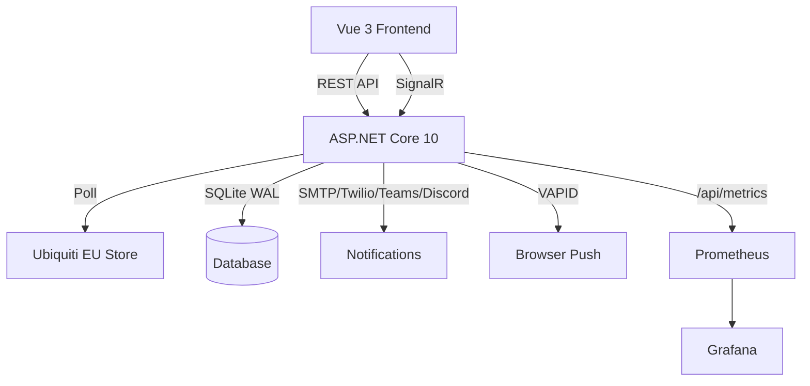

# Ubiquiti EU Store Stock Monitor

Monitors Ubiquiti product pages on the EU store and notifies you the moment stock becomes available.

## Features

- Polls configurable product URLs at a per-product interval
- Multi-strategy HTML parser (JSON-LD → button state → text content)
- Stock state machine with hysteresis (prevents flapping notifications)
- Notifications: browser push (VAPID), e-mail (SMTP), SMS (Twilio), Teams webhook, Discord webhook
- Real-time updates via SignalR
- Prometheus metrics endpoint + Grafana integration
- SQLite with WAL mode for reliable persistence

## Architecture



## Quick Start

```bash
docker compose up -d
```

Then navigate to `http://localhost:8080/setup` (or `https://ubiquitistorelurker.rverbist.io`), add product URLs, and configure your notification channels.

## Environment Variables

| Variable | Default | Description |
|---|---|---|
| `ASPNETCORE_ENVIRONMENT` | `Production` | Runtime environment (`Production` / `Development`) |
| `ASPNETCORE_URLS` | `http://+:8080` | Kestrel listen addresses |
| `ConnectionStrings__ubiquitistorelurker-db` | `Data Source=/data/ubiquitistorelurker.db` | SQLite connection string |
| `DATA_DIR` | `/data` | Directory for the SQLite database file |
| `Polling__IntervalSeconds` | `60` | Default poll interval per product (seconds) |
| `Polling__SchedulerScanIntervalSeconds` | `10` | How often the scheduler scans for due polls |
| `Polling__UserAgent` | see appsettings | HTTP User-Agent sent to the store |

Notification settings (SMTP host/port, Twilio SID, webhook URLs) are stored in the database and configured via the `/setup` UI.

## Volumes

| Path (in container) | Purpose |
|---|---|
| `/data` | SQLite database |
| `/logs` | Structured JSON log files (production only) |

## Setup

1. Start the container: `docker compose up -d`
2. Open the web UI (port 8080)
3. Navigate to **Setup**
4. Add one or more Ubiquiti product URLs to monitor
5. Configure notification channels (SMTP, SMS, webhooks, browser push)
6. Products are polled automatically; you receive a notification when state changes to *In Stock*

## Development

### Backend (ASP.NET Core 10)

```bash
cd src
dotnet run --project UbiquitiStoreLurker.Web
```

API is served at `http://localhost:5000`.

### Frontend (Vue 3 + Vite)

```bash
cd src/UbiquitiStoreLurker.Web/ClientApp
npm install
npm run dev
```

Vite dev server proxies `/api` and `/ubiquitistorelurker-hub` to the backend automatically.

### Tests

```bash
cd src
dotnet test
```

### Code Coverage

```bash
cd src
dotnet test --collect:"XPlat Code Coverage"
```

## Development Modes

UbiquitiStoreLurker supports three development modes, each with different tooling:

### Mode 1 — Plain dotnet run (no Aspire, no Docker)

Quickest way to run for basic development:

```bash
dotnet run --project src/UbiquitiStoreLurker.Web
```

| Service | URL |
|---|---|
| App | <http://localhost:5000> |
| Swagger UI | <http://localhost:5000/swagger> |
| Metrics | <http://localhost:5000/api/metrics> |
| Grafana (lab) | <https://grafana.rverbist.io> |

### Mode 2 — Aspire AppHost (full local observability)

Launches app + SQLiteWeb browser + local Prometheus + local Grafana + Aspire Dashboard:

**First-run secrets setup (required once per machine):**

```bash
dotnet user-secrets set "Parameters:smtp-password"   "<value>" --project src/UbiquitiStoreLurker.AppHost
dotnet user-secrets set "Parameters:twilio-token"    "<value>" --project src/UbiquitiStoreLurker.AppHost
dotnet user-secrets set "Parameters:discord-webhook" "<value>" --project src/UbiquitiStoreLurker.AppHost
dotnet user-secrets set "Parameters:teams-webhook"   "<value>" --project src/UbiquitiStoreLurker.AppHost
```

```bash
dotnet run --project src/UbiquitiStoreLurker.AppHost
```

| Service | URL |
|---|---|
| App | <http://localhost:5000> |
| Aspire Dashboard | <http://localhost:15888> |
| Grafana (local container) | <http://localhost:3000> |
| SQLiteWeb (`ubiquitistorelurker-db-sqliteweb`) | Dynamic port — open the Aspire Dashboard → **Resources** tab → click the link next to `ubiquitistorelurker-db-sqliteweb`. All tables are browsable: `Products`, `StockChecks`, `NotificationLogs`, `AppSettings`, `PushSubscriptions`. Reads the same live SQLite file as the running app. |

### Mode 3 — Docker Compose (local or Proxmox production)

**Local:**

```bash
docker compose up -d
```

**Deploy to Proxmox** — use VS Code Task → `UbiquitiStoreLurker: Deploy — Proxmox`

| Service | Local URL | Proxmox URL |
|---|---|---|
| App | <http://localhost:8080> | <https://ubiquitistorelurker.rverbist.io> |
| Aspire Dashboard | <http://localhost:18888> | <https://aspire.ubiquitistorelurker.rverbist.io> |
| Grafana (lab) | — | <https://grafana.rverbist.io> |

> **Note:** Grafana in Docker mode uses the existing lab stack at grafana.rverbist.io — no new Grafana container is started.

### Running tests

```bash
# Unit + integration tests (no Docker required)
dotnet test tests/UbiquitiStoreLurker.Tests/

# Aspire integration tests (requires Docker daemon)
dotnet test tests/UbiquitiStoreLurker.AppHostTests/ --filter "Category=RequiresDocker"

# Skip Docker tests in CI
dotnet test tests/UbiquitiStoreLurker.AppHostTests/ --filter "Category!=RequiresDocker"
```

## Docker Build

```bash
docker build -t ubiquitistorelurker:latest .
```

The Dockerfile uses a multi-stage build:

1. **build** — restores NuGet, builds the Vue app with Vite, then publishes the .NET app
2. **test** — runs `dotnet test` against the published build (build fails if any test fails)
3. **final** — minimal `aspnet:10.0-alpine` runtime image, non-root user, exposes port 8080

## Prometheus / Grafana

Metrics are available at `/api/metrics` in the Prometheus text format. Import the included Grafana dashboard or scrape the endpoint directly.

| Metric | Description |
|---|---|
| `ubiquitistorelurker_checks_total` | Total poll attempts (labelled `success`/`error`) |
| `ubiquitistorelurker_poll_duration_seconds` | Histogram of HTTP poll durations |
| `ubiquitistorelurker_monitored_products_total` | Total number of products in the database |
| `ubiquitistorelurker_active_products` | Number of active (polling) products |

## Observability — Pull vs Push

UbiquitiStoreLurker uses a dual-path observability architecture:

```
UbiquitiStoreLurker app
  │
  └─ OTLP gRPC (push) ──► ubiquitistorelurker-otel-collector (172.18.2.6)
                               ├─ metrics ──► Prometheus remote-write ──► lab Prometheus (172.18.1.1)
                               └─ traces  ──► OTLP gRPC ──────────────► Aspire Dashboard (172.18.2.5:18889)

lab Prometheus (172.18.1.1)
  │
  └─ pull scrape every 15 s ──► /api/metrics (prometheus-net text format)
```

**Pull path** (unchanged from Phase 10): Prometheus scrapes `/api/metrics` on the standard 15 s interval. All prometheus-net counters, gauges, and histograms flow through this path. The Grafana dashboard (`ubiquitistorelurker-dashboard.json`) reads from this path.

**Push path** (added in this task): The app pushes OTLP telemetry to the OTel Collector sidecar (`ubiquitistorelurker-otel-collector`) on port 4317. The Collector fans out:

- Metrics → Prometheus remote-write (`POST /api/v1/write`) into the lab Prometheus — same data, different ingestion path. Useful for higher-granularity push intervals without changing the scrape config.
- Traces → Aspire Dashboard OTLP receiver — trace waterfall visible at `https://aspire.ubiquitistorelurker.rverbist.io` in Docker/Proxmox mode (previously only available in Aspire AppHost dev mode).

### Lab Prometheus remote-write receiver

The lab Prometheus is configured with `--web.enable-remote-write-receiver` (added to `/opt/docker/infra/monitoring/docker-compose.yml`). Apply with:

```bash
cd /opt/docker/infra/monitoring && docker compose up -d prometheus
```

### OTel Collector configuration

`src/otel-collector.yaml` — mounted read-only into the `ubiquitistorelurker-otel-collector` container. Edit and `docker compose up -d ubiquitistorelurker-otel-collector` to apply changes without restarting the app.

## Migration Notes

### Connection string key rename (2026-03-24)

The SQLite connection string key was renamed from `Default` to `ubiquitistorelurker-db` to align with the Aspire resource name (`builder.AddSqlite("ubiquitistorelurker-db")`).

If you have an existing deployment using the old key, update the environment variable:

```bash
# Old (no longer used)
ConnectionStrings__Default=Data Source=/data/ubiquitistorelurker.db

# New
ConnectionStrings__ubiquitistorelurker-db=Data Source=/data/ubiquitistorelurker.db
```

The Docker Compose file, both `appsettings.json` files, and `Program.cs` all use the new key — no further changes required.
